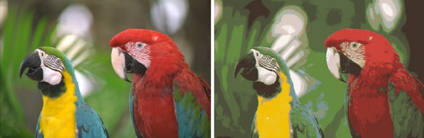
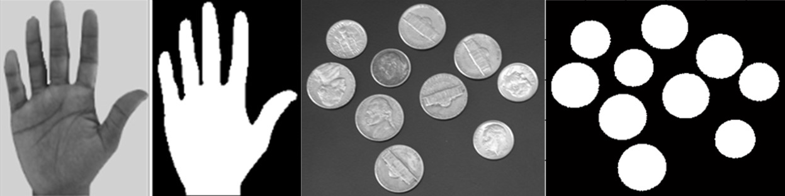
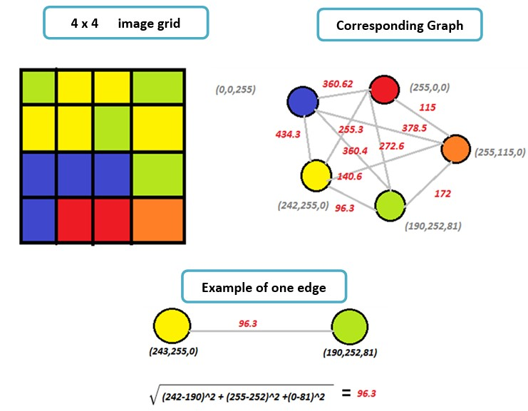
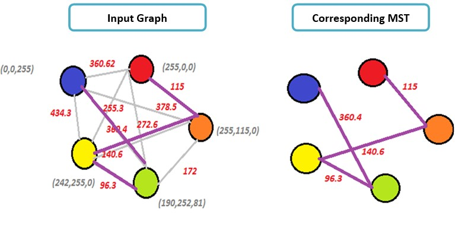
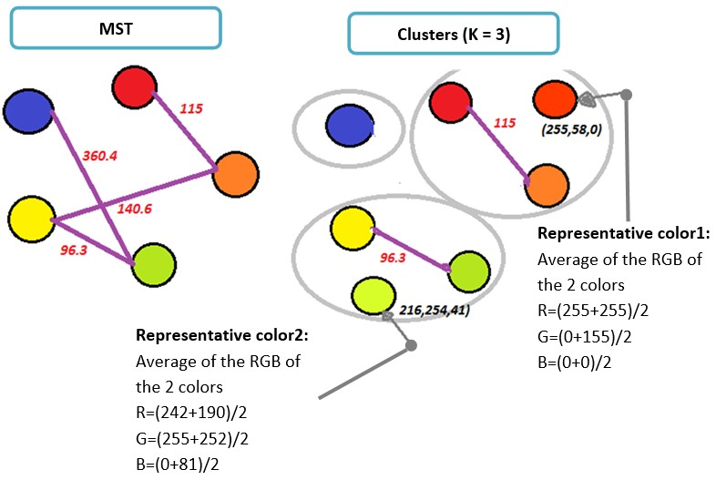

# Image Color Quantization

## Table of Contents

- [Table of Contents](#table-of-contents)
- [What is Image Quantization?](#what-is-image-quantization-)
  * [Overview](#overview)
  * [Some Usages](#some-usages)
  * [Main Steps](#main-steps)
- [Image Quantization Algorithm](#image-quantization-algorithm)
- [Dependencies](#dependencies)

## What is Image Quantization?

### Overview

The idea of *color quantization* is to reduce the number of colors in a full resolution digital color image (24 bits per pixel) to a smaller set of representative colors called **color palette.** Reduction should be performed so that the quantized image differs as little as possible from the original image. Algorithmic optimization task is to find such a color palette that the overall distortion is minimized.

Example of a 24-bit color image quantized to 16 colors:

### Some Usages

1. **Target different devices:** color quantization is critical for displaying images with many colors on devices that can only display a limited number of colors, usually due to memory limitations.

2. **Image compression:** by reducing number of bits per pixels without affecting the image view. It’s used as a step in the compression pipeline of most common formats like JPEG and MPEG.

3. **Image segmentation:** is the process extracting useful objects from an image. It usually done by assigning a label to every pixel in an image such that pixels with the same label share certain characteristics (e.g. same colors). Examples are shown in the figure below:

### Main Steps

Color quantization consists of two main steps:

1. **Palette Generation:** A palette generation algorithm finds a smaller representative set of colors **C** = *{c1,c2,c3,…,ck}*  from the *D* distinct colors.

2. **Quantization:** by mapping the original colors to the palette colors.

## Image Quantization Algorithm

To Apply the Single-linkage Clustering algorithm on the Image Quantization Problem, we need to:

**1.**   Find the **distinct colors** *D = {d1, d2, d3 ….dm}* from the input image. Can be known from the image histogram.

**2.**   Construct a **fully-connected** **undirected weighted graph** *G* with

- *D* vertices (number of distinct colors). 

- Each pair of vertices is connected by a single edge. 

- Edge weight is set as the Euclidean Distance between the RGB values of the 2 vertices.

**Example:**

**3.**   Construct  a [minimum-spanning-tree algorithm](https://en.wikipedia.org/wiki/Minimum_spanning_tree#Algorithms) (a [greedy algorithm](https://en.wikipedia.org/wiki/Greedy_algorithm) in [graph theory](https://en.wikipedia.org/wiki/Graph_theory))

> We chose [Prim's Algorithm](https://en.wikipedia.org/wiki/Prim%27s_algorithm)

- **Input:** connected undirected weighted graph

- **Output:** a tree that keeps the graph connected with minimum total cost

- **Methodology:** treats the graph as a forest and each node is initially represented as a tree. A tree is connected to another only and only if it has the least cost among all available. 

- **Conclusion:** the Minimum Spanning Tree is an implementation of single linkage clustering Strategy that repeats merging distinct points with minimal distances into  a single cluster

After executing the Minimum Spanning tree of the Distinct Color Graph will be:

**4.**   Extract the desired number of clusters (K) with maximum distances between each other. 

**5.**   Find the representative color of each cluster.

**6.**   Quantize the image by replacing the colors of each cluster by its representative color.

## Dependencies

1. .Net framework version 4.5